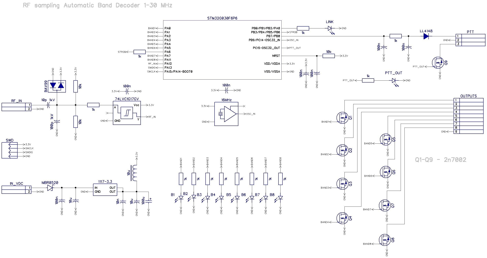

Дополнение от r3tjl:
В данной ветке расположен код, вместо простого включения диапазонов на Band pins 1-8
формируется 4-пиновый код диапазона стандарта Yaesu ABCD, задействованы пины 1-4 соответстенно. Пины 5-8 ДУБЛИРУЮТ пины 1-4 (2 раздельных выхода у декодера).

# RF sampling Automatic Band Decoder 1-30 MHz

This board provides automatic band switching capabilities for LPF and antenna switches for any radio rig. The main principle is to count the RF frequency during tuning and use the STM32G030 CPU as a frequency counter and a switch.

### How it works

1. Wait for PTT (GND active) to be activated
2. Once PTT activated, wait for RF to appear
3. Measure incoming RF
4. Set the output according to measured frequency
5. LPF relay activation 10ms time delay
6. Set output PTT (GND active)
7. Wait for PTT to be released
8. Go back to waiting for PTT

### Board band plan 

B1 — 160

B2 — 80

B3 — 40

B4 — 30

B5 — 20

B6 — 17

B7 — 15

B8 — 12/11/10

### Technical specification

Power supply: 6.5-15V, 10mA

Input RF impedance: >1 kΩ

Maximum input frequency: 32MHz

Maximum RF input: 50W

Measurement time: ~4ms

Number of 50V/100mA outputs: 8

Board sizes 60×50 mm

------

### More information:

https://ra0sms.com/rf-band-decoder/

------

